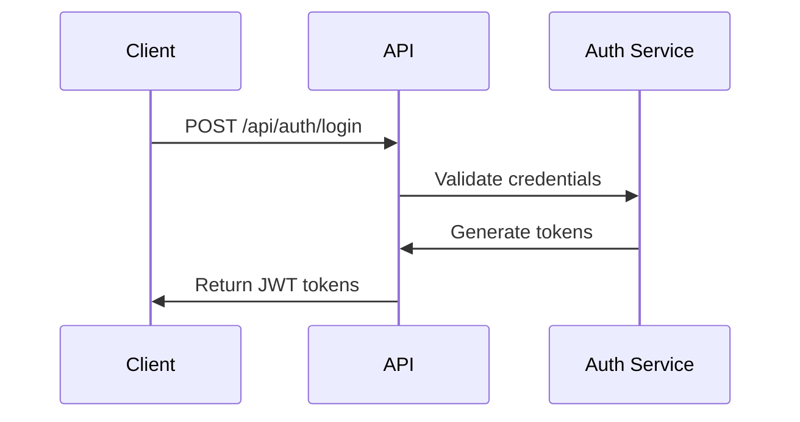

# SportsCenter API Design

## API Design Principles

### RESTful Endpoints
- Resource-oriented design
- Standard HTTP methods
- Proper status code usage
- Consistent URL structure

### GraphQL Interface
- Complex data queries
- Real-time subscriptions
- Type-safe schema
- Optimized data fetching

## Authentication

### Endpoints


### Routes Structure
```clojure
["/api"
 ["/auth"
  ["/login" {:post auth-handler/login}]
  ["/refresh" {:post auth-handler/refresh}]
  ["/logout" {:post auth-handler/logout}]]
 
 ["/users"
  ["" {:get users-handler/list-users
       :post users-handler/create-user}]
  ["/:id" {:get users-handler/get-user
           :put users-handler/update-user
           :delete users-handler/delete-user}]]
 
 ["/training"
  ["" {:get training-handler/list-plans
       :post training-handler/create-plan}]
  ["/:id" {:get training-handler/get-plan
           :put training-handler/update-plan
           :delete training-handler/delete-plan}]]]
```

## Response Format

### Success Response
```json
{
  "status": "success",
  "data": {
    "id": "123",
    "type": "user",
    "attributes": {
      "name": "John Doe",
      "email": "john@example.com"
    }
  }
}
```

### Error Response
```json
{
  "status": "error",
  "error": {
    "code": "AUTH_001",
    "message": "Invalid credentials",
    "details": {
      "field": "password",
      "reason": "incorrect"
    }
  }
}
```

## API Versioning
- URL-based versioning (/api/v1/...)
- Header-based version fallback
- Deprecation notices
- Version lifecycle management

## Rate Limiting
- Per-user limits
- IP-based limits
- Endpoint-specific limits
- Rate limit headers

## Documentation
- OpenAPI/Swagger specs
- Interactive documentation
- Code examples
- Postman collections
