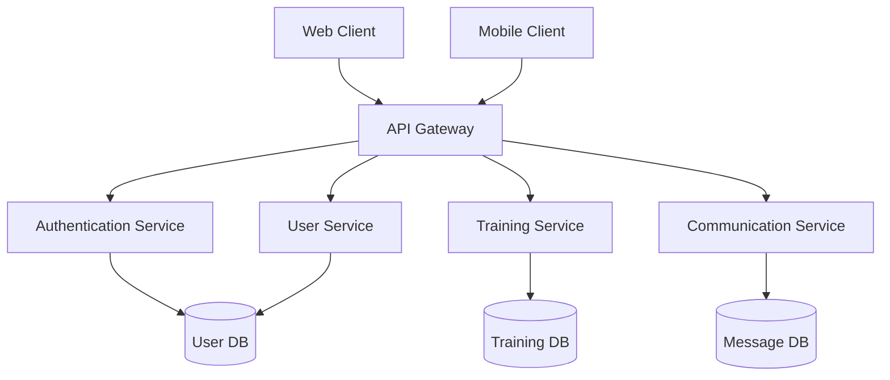

# SportsCenter System Architecture

## System Overview

## Architecture Components

### Frontend Layer
- **Web Application**: React.js with TypeScript
- **Mobile Application**: React Native with Expo
- **Shared Components**: Common UI library and business logic

### API Layer
- **API Gateway**: Ring/Reitit-based routing
- **GraphQL Interface**: Lacinia for complex queries
- **REST Endpoints**: Standard HTTP/JSON APIs

### Service Layer
- **Authentication Service**: JWT-based auth system
- **User Service**: User management and profiles
- **Training Service**: Training plans and progress tracking
- **Communication Service**: Real-time messaging and notifications

### Data Layer
- **Primary Database**: PostgreSQL
- **Cache Layer**: Redis
- **File Storage**: AWS S3
- **Search Index**: Elasticsearch

## Security Architecture

### Authentication
- JWT-based token system
- Refresh token rotation
- OAuth2 integration for third-party auth

### Authorization
- Role-based access control (RBAC)
- Resource-level permissions
- API scope control

### Data Security
- End-to-end encryption for messages
- At-rest encryption for sensitive data
- Regular security audits

## Scalability Design

### Horizontal Scaling
- Stateless services
- Load balancing
- Database replication

### Performance Optimization
- CDN integration
- Caching strategy
- Database indexing

## Monitoring and Logging

### System Monitoring
- Performance metrics
- Error tracking
- User analytics

### Logging
- Centralized logging
- Audit trails
- Performance profiling
