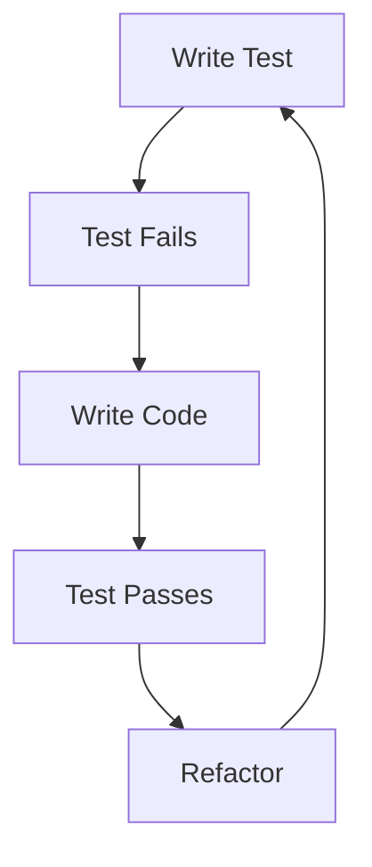

# SportsCenter Development Plan (TDD Approach)

## Overview
This document outlines the development plan for the SportsCenter platform, focusing on Test-Driven Development (TDD) for the web application and backend components. The development will follow the "Red-Green-Refactor" cycle of TDD.

## Development Phases

### Phase 1: Project Setup and Infrastructure (Week 1)

#### Backend Setup
1. **Initial Setup**
   - Set up Clojure project structure
   - Configure development environment
   - Set up test framework (clojure.test)
   - Configure CI/CD pipeline

2. **Database Setup**
   - Set up PostgreSQL database
   - Create test database
   - Write database migration tests
   - Implement database migrations

3. **Authentication System**
   - Write tests for user authentication
   - Implement JWT authentication
   - Test security middleware
   - Implement role-based access control

#### Web Application Setup
1. **Project Structure**
   - Set up React project with TypeScript
   - Configure testing environment (Jest + React Testing Library)
   - Set up CI/CD pipeline

2. **Core Components**
   - Write tests for basic components
   - Implement component library
   - Set up routing tests
   - Implement basic routing

### Phase 2: Core Features Development (Weeks 2-3)

#### Backend API Development
1. **User Management API**
   ```mermaid
   graph TD
     A[Write User Tests] --> B[Implement User API]
     B --> C[Write Auth Tests]
     C --> D[Implement Auth]
     D --> E[Integration Tests]
   ```
   - Write tests for user CRUD operations
   - Implement user management endpoints
   - Write tests for authentication flows
   - Implement authentication endpoints

2. **Profile Management API**
   - Write tests for profile operations
   - Implement profile endpoints
   - Test profile validation
   - Implement data validation

#### Web Application Core Features
1. **Authentication Components**
   ```mermaid
   graph TD
     A[Login Tests] --> B[Login Component]
     B --> C[Registration Tests]
     C --> D[Registration Component]
     D --> E[Integration Tests]
   ```
   - Write tests for login flow
   - Implement login components
   - Write tests for registration
   - Implement registration components

2. **User Dashboard**
   - Write tests for dashboard components
   - Implement dashboard layout
   - Test data visualization components
   - Implement charts and graphs

### Phase 3: Advanced Features (Weeks 4-5)

#### Backend Services
1. **Training Management**
   ```mermaid
   graph TD
     A[Training Plan Tests] --> B[Training API]
     B --> C[Progress Tests]
     C --> D[Progress API]
     D --> E[Integration Tests]
   ```
   - Write tests for training plan management
   - Implement training plan API
   - Write tests for progress tracking
   - Implement progress tracking API

2. **Analytics Service**
   - Write tests for data analysis
   - Implement analytics engine
   - Test reporting functions
   - Implement reporting API

#### Web Application Features
1. **Training Interface**
   - Write tests for training components
   - Implement training interface
   - Test progress visualization
   - Implement progress tracking UI

2. **Analytics Dashboard**
   - Write tests for analytics components
   - Implement analytics dashboard
   - Test reporting interface
   - Implement report generation

### Phase 4: Integration and Testing (Week 6)

#### System Integration
1. **API Integration**
   ```mermaid
   graph TD
     A[Integration Tests] --> B[API Integration]
     B --> C[Performance Tests]
     C --> D[Load Testing]
     D --> E[Security Tests]
   ```
   - Write end-to-end tests
   - Implement API integration
   - Write performance tests
   - Implement monitoring

2. **Security Testing**
   - Write security test cases
   - Implement security measures
   - Test authentication flow
   - Implement security monitoring

## Future Enhancements (Postponed)
### Elasticsearch Integration
- Full-text search capabilities
- Advanced search features
- Analytics and reporting
- Performance monitoring dashboards

## Testing Strategy

### Backend Testing
1. **Unit Tests**
   - Controller tests
   - Service layer tests
   - Data access tests
   - Utility function tests

2. **Integration Tests**
   - API endpoint tests
   - Database integration tests
   - External service integration tests

3. **Performance Tests**
   - Load testing
   - Stress testing
   - Endurance testing

### Frontend Testing
1. **Unit Tests**
   - Component tests
   - Hook tests
   - Utility function tests
   - State management tests

2. **Integration Tests**
   - Page tests
   - User flow tests
   - API integration tests

3. **End-to-End Tests**
   - User journey tests
   - Cross-browser tests
   - Mobile responsiveness tests

## Development Workflow


1. **Write Test**
   - Write a failing test
   - Define expected behavior
   - Document test cases

2. **Implement Feature**
   - Write minimal code to pass test
   - Follow SOLID principles
   - Maintain clean code

3. **Refactor**
   - Improve code quality
   - Optimize performance
   - Update documentation

## Quality Metrics
- Test coverage > 80%
- Code quality (SonarQube metrics)
- Performance benchmarks
- Security compliance

## Tools and Libraries

### Backend Testing
- clojure.test
- test.check for property-based testing
- ring-mock for HTTP testing
- test.jdbc for database testing

### Frontend Testing
- Jest
- React Testing Library
- Cypress for E2E testing
- MSW for API mocking

## Continuous Integration
- Automated test runs
- Code quality checks
- Security scanning
- Performance monitoring

This development plan provides a structured approach to building the SportsCenter platform using TDD. Each phase builds upon the previous one, ensuring a solid foundation and maintainable codebase.
