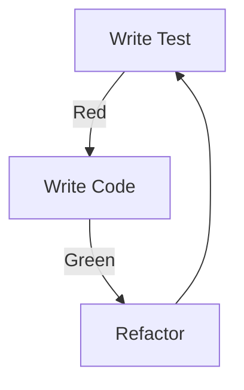

# SportsCenter Testing Strategy

## Testing Approach

### Test-Driven Development (TDD)

## Test Categories

### Unit Tests
- Individual component testing
- Function-level tests
- Mocked dependencies
- Quick execution

### Integration Tests
- Component interaction testing
- API endpoint testing
- Database integration
- Service communication

### End-to-End Tests
- User flow testing
- Cross-browser testing
- Mobile device testing
- Performance testing

## Testing Tools

### Backend Testing
- clojure.test for unit tests
- test.check for property testing
- ring-mock for HTTP testing
- test.jdbc for database testing

### Frontend Testing
- Jest for unit tests
- React Testing Library
- Cypress for E2E tests
- MSW for API mocking

### Mobile Testing
- Jest for React Native
- Detox for E2E testing
- Device farm testing
- Platform-specific tests

## Test Coverage

### Coverage Goals
- Backend: 90%+ coverage
- Frontend: 85%+ coverage
- Critical paths: 100%
- API endpoints: 100%

### Coverage Monitoring
- Regular coverage reports
- CI/CD integration
- Coverage trends
- Hot spot analysis

## Testing Environments

### Local Development
- Unit test environment
- Integration test DB
- Mocked services
- Quick feedback loop

### CI/CD Pipeline
- Automated test suite
- Performance testing
- Security scanning
- Regression testing

### Staging Environment
- Production-like setup
- Data sanitization
- Load testing
- User acceptance testing

## Test Documentation

### Test Plans
- Test scenarios
- Test cases
- Expected results
- Edge cases

### Test Reports
- Execution results
- Coverage reports
- Performance metrics
- Issue tracking
