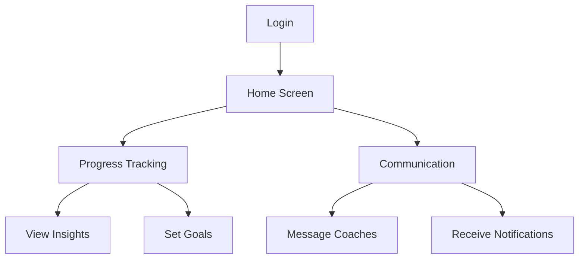
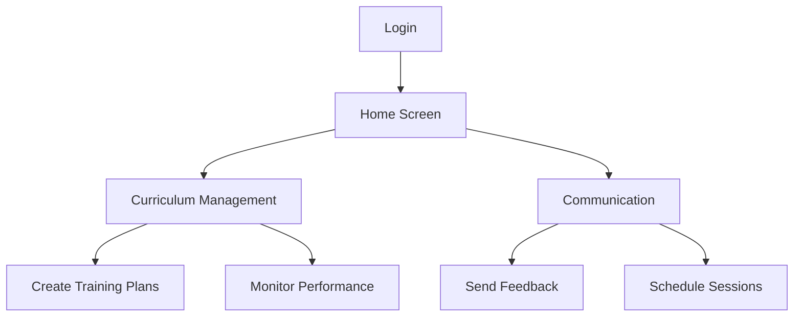
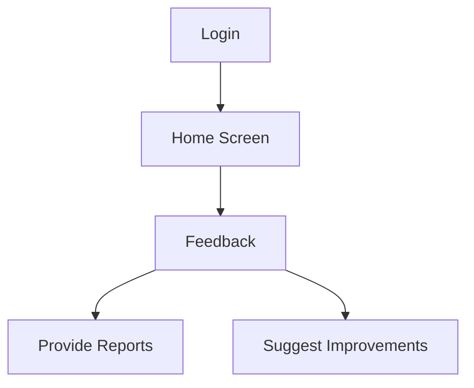
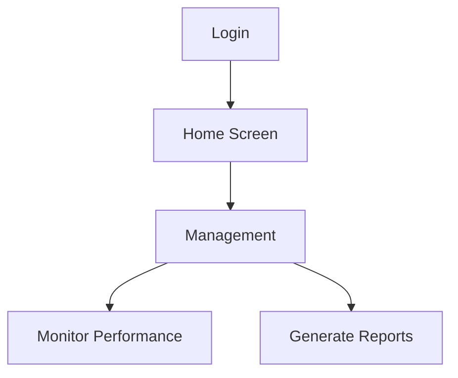
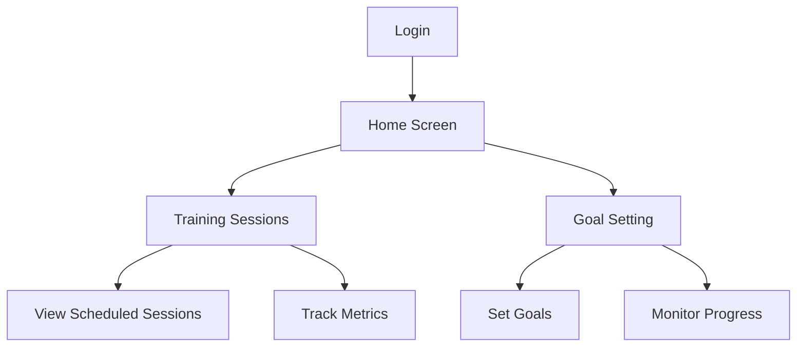
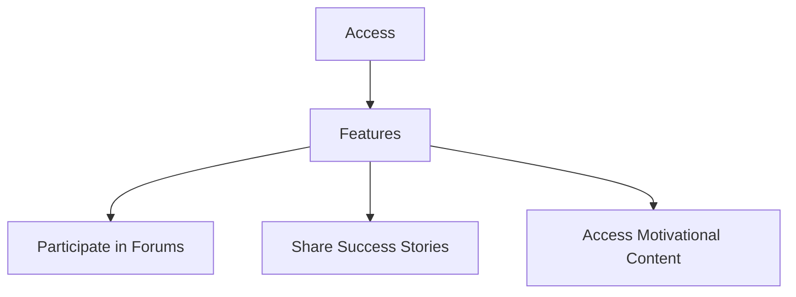
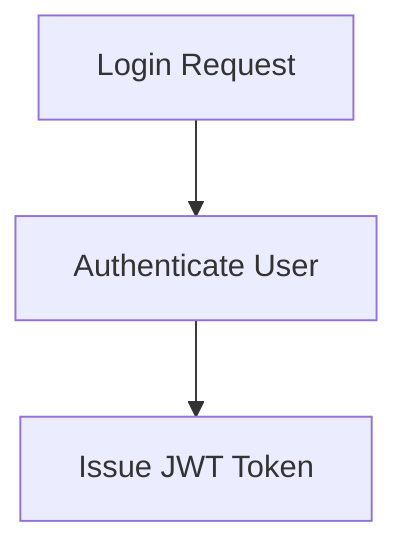
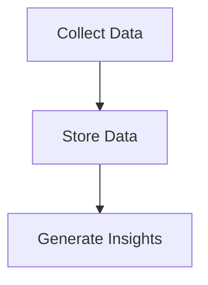
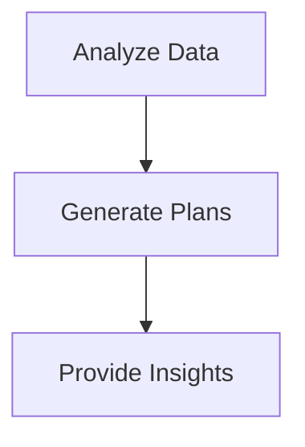
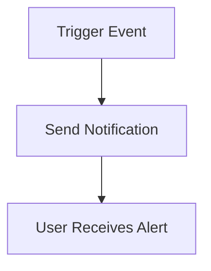

# SportsCenter App Flow Documentation

## Overview
This document describes the detailed application flow for the SportsCenter platform, covering both web and mobile applications. It outlines user interactions, navigation paths, and system processes for each user role.

## User Roles
1. **Parent**
2. **Coach**
3. **Mentor**
4. **Athlete**
5. **Admin**

## Web Application Flow

### Parent Dashboard

- **Login**: Parents log in using their credentials.
- **Home Screen**:
  - Overview of child's progress
  - Access to video logs and performance updates
- **Progress Tracking**:
  - View detailed insights and analytics
  - Set and track long-term goals
- **Communication**:
  - Message coaches and mentors
  - Receive notifications and updates

### Coach Portal

- **Login**: Coaches log in using their credentials.
- **Home Screen**:
  - Overview of athletes
  - Access to training plans and progress reports
- **Curriculum Management**:
  - Create and customize training plans
  - Monitor athlete performance
- **Communication**:
  - Send feedback to athletes and parents
  - Schedule sessions and meetings

### Mentor Feedback System

- **Login**: Mentors log in using their credentials.
- **Home Screen**:
  - Overview of assigned athletes
  - Access to performance data and reports
- **Feedback**:
  - Provide detailed mentorship reports
  - Suggest improvements and track progress

### Admin Panel

- **Login**: Admins log in using their credentials.
- **Home Screen**:
  - Overview of platform usage
  - Access to user management and analytics
- **Management**:
  - Monitor system performance
  - Generate reports and insights

## Mobile Application Flow

### Athlete Portal

- **Login**: Athletes log in using their credentials.
- **Home Screen**:
  - Overview of personal progress
  - Access to training sessions and goals
- **Training Sessions**:
  - View scheduled sessions
  - Track performance metrics
- **Goal Setting**:
  - Set personal goals and milestones
  - Monitor progress towards goals

### Community Hub

- **Access**: Available to all user roles.
- **Features**:
  - Participate in forums and discussions
  - Share success stories and experiences
  - Access motivational content and webinars

## System Processes

### Authentication

- **Process**:
  - Users authenticate using email/password or social login
  - JWT tokens are issued for session management

### Data Management

- **Process**:
  - Athlete performance data is collected and stored
  - Video logs and insights are generated and updated

### AI Integration

- **Process**:
  - AI algorithms analyze performance data
  - Personalized training plans and insights are generated

### Notifications

- **Process**:
  - Users receive notifications for updates and alerts
  - Customizable notification settings

## Key Features
- **Real-time Updates**: Live data updates and notifications
- **Video Analysis**: AI-powered technique breakdown
- **Nutrition and Fitness Plans**: Personalized and expert-verified
- **Coach-Athlete Matching**: AI-driven recommendations

This document provides a comprehensive view of the application flow, ensuring a clear understanding of user interactions and system processes within the SportsCenter platform.
